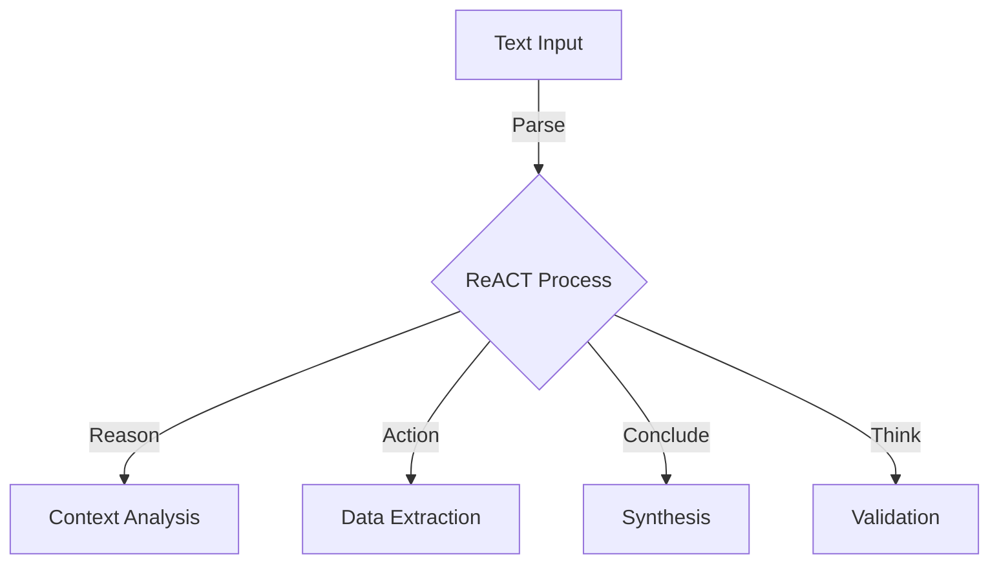
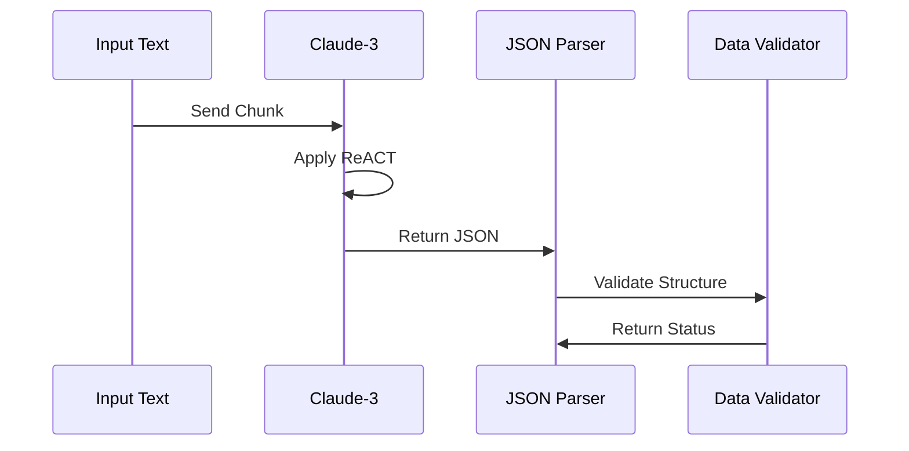
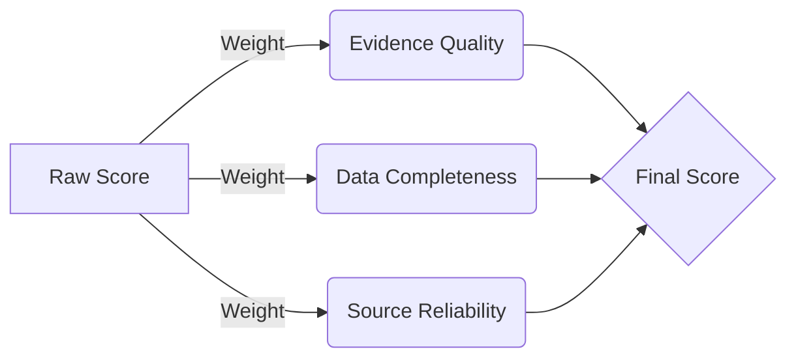
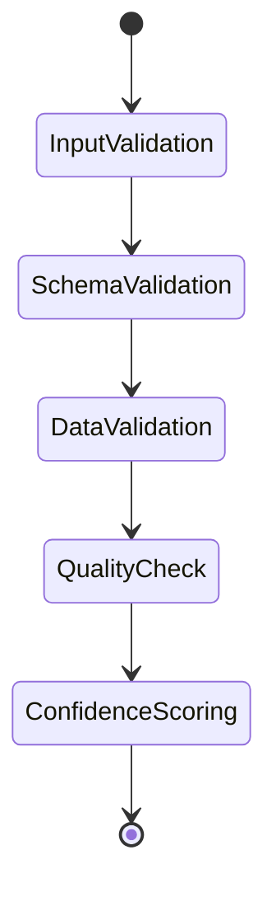
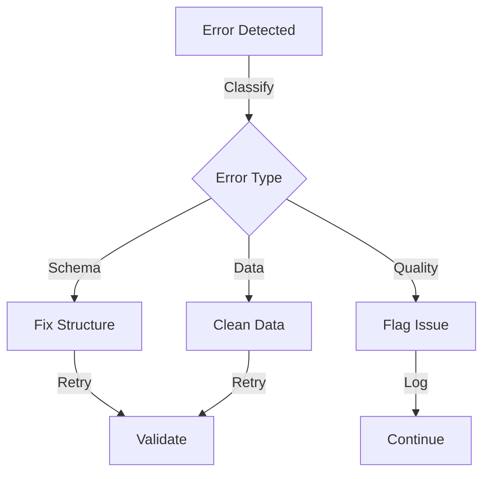

# Prompting Strategy & LLM Architecture

## ReACT Prompting Flow

### Stage 1: Initial Analysis



### Stage 2: Structured Extraction



### Stage 3: Confidence Scoring



## Prompt Evolution & Optimization

### 1. Basic Prompt Structure

```python
BASIC_PROMPT = """
Analyze this medical text for:
1. Genetic variants
2. Clinical evidence
3. Molecular mechanisms
"""
```

### 2. ReACT Integration

```python
REACT_PROMPT = """
Use ReACT methodology to analyze:
1. REASON about evidence quality
2. ACT to extract structured data
3. CONCLUDE with confidence levels
4. THINK about validation
"""
```

### 3. Final Structured Prompt

```python
STRUCTURED_PROMPT = """
Provide JSON output with:
{
    "variants": [...],
    "evidence": [...],
    "molecular": [...],
    "confidence": {...}
}
Include ReACT reasoning in each section.
"""
```

## Validation Strategy

### Data Validation Flow



### Error Recovery Strategy


