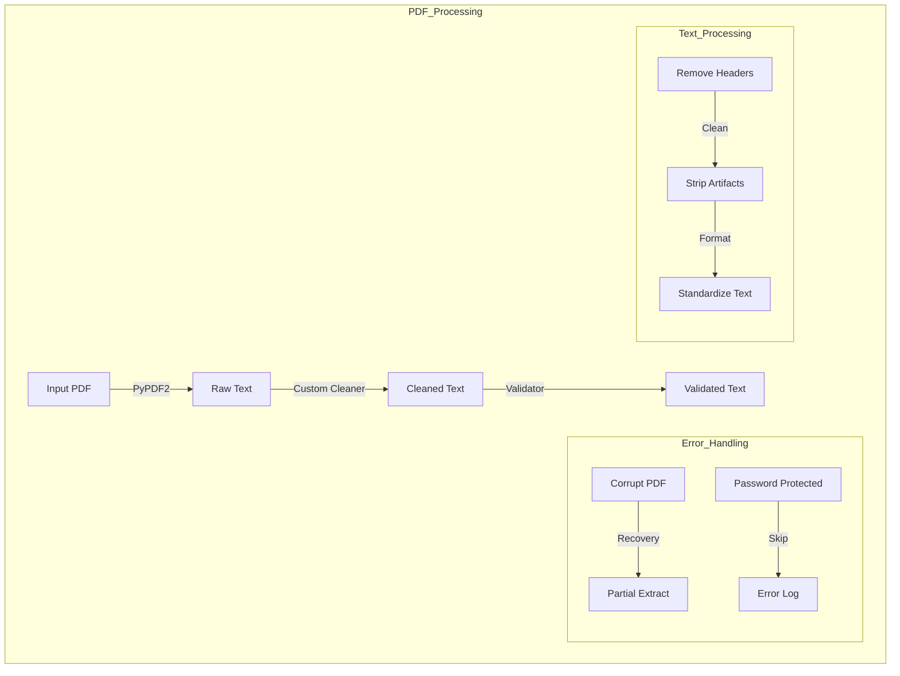
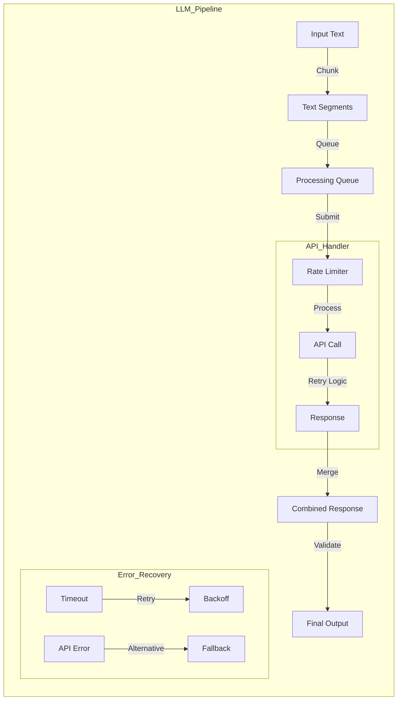
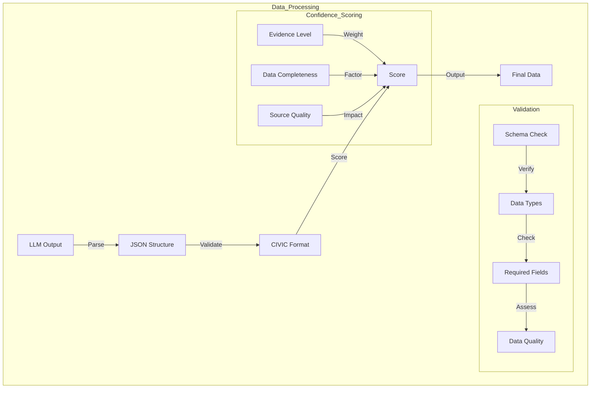
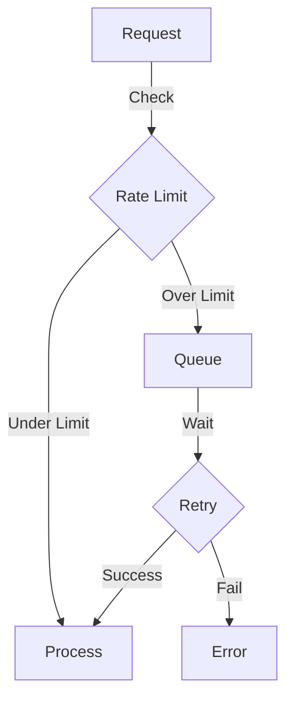
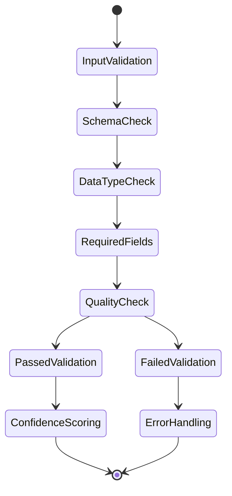
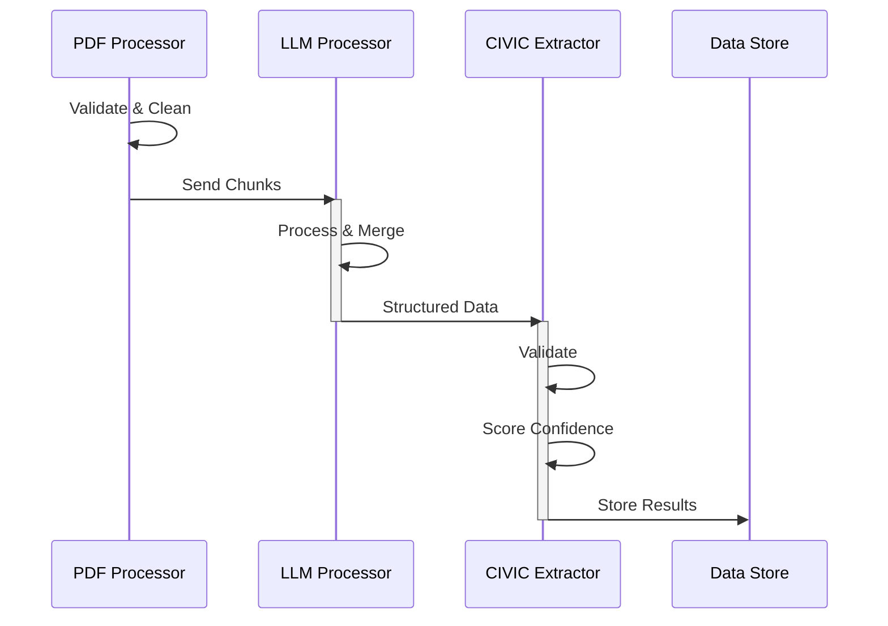
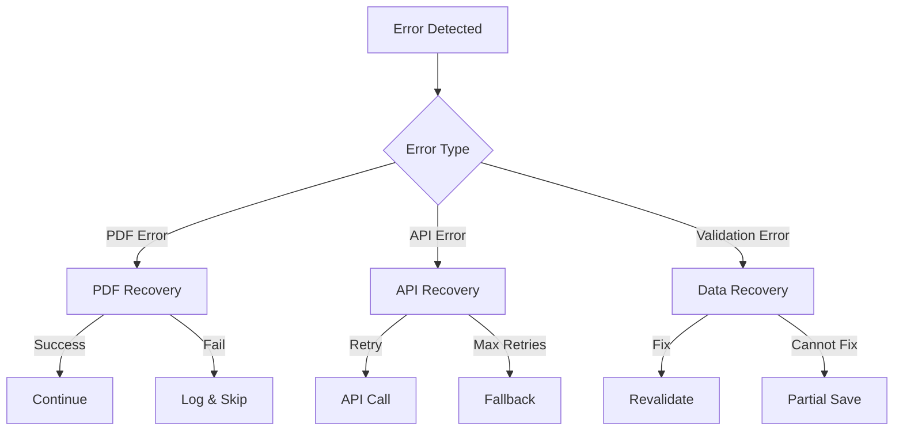
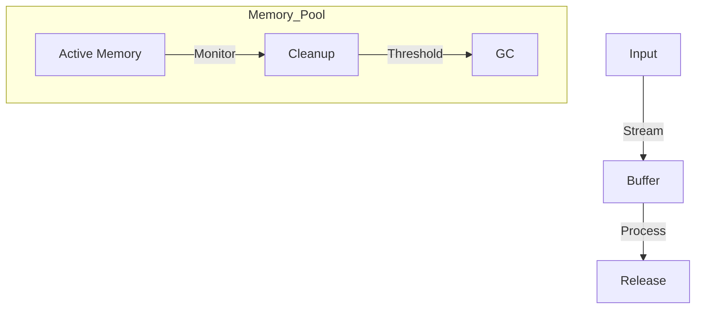
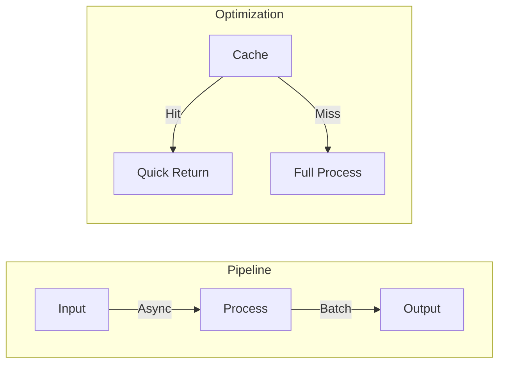

# Technical Specifications & Architecture Details

## System Components Technical Details

### 1. PDF Processor Technical Flow



### 2. LLM Processor Architecture



### 3. CIVIC Extractor Component Design



## Component Technical Specifications

### 1. PDF Processor Specifications

#### Input Handling

```python
class PDFProcessor:
    MAX_FILE_SIZE = 100 * 1024 * 1024  # 100MB
    SUPPORTED_FORMATS = ['.pdf']
    CHUNK_SIZE = 1024 * 1024  # 1MB chunks
  
    TEXT_CLEANING_RULES = {
        'remove_headers': True,
        'strip_numbers': False,
        'normalize_spaces': True,
        'remove_citations': False
    }
```

#### Performance Parameters

- Maximum file size: 100MB
- Processing speed: ~1MB/second
- Memory usage: <500MB
- Concurrent files: Up to 5

### 2. LLM Processor Specifications

#### API Configuration

```python
class LLMConfig:
    MAX_TOKENS = 4000
    TEMPERATURE = 0.0
    TOP_P = 1.0
    FREQUENCY_PENALTY = 0.0
    PRESENCE_PENALTY = 0.0
  
    RETRY_ATTEMPTS = 3
    RETRY_DELAY = [1, 2, 4]  # Exponential backoff
  
    RATE_LIMITS = {
        'requests_per_minute': 50,
        'tokens_per_minute': 100000
    }
```

#### Rate Limiting Strategy



### 3. CIVIC Extractor Specifications

#### Data Model Requirements

```python
class ValidationRules:
    REQUIRED_FIELDS = {
        'variants': ['name', 'type', 'significance'],
        'clinical_evidence': ['type', 'significance'],
        'molecular_data': ['pathway', 'alterations']
    }
  
    CONFIDENCE_WEIGHTS = {
        'evidence_quality': 0.4,
        'data_completeness': 0.3,
        'source_reliability': 0.3
    }
```

#### Validation Flow



## System Integration Details

### 1. Component Communication



### 2. Error Recovery Strategy



## Performance Optimizations

### 1. Memory Management



### 2. Processing Pipeline


